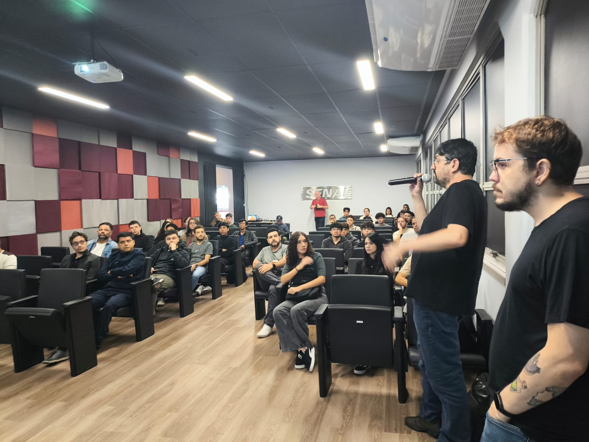
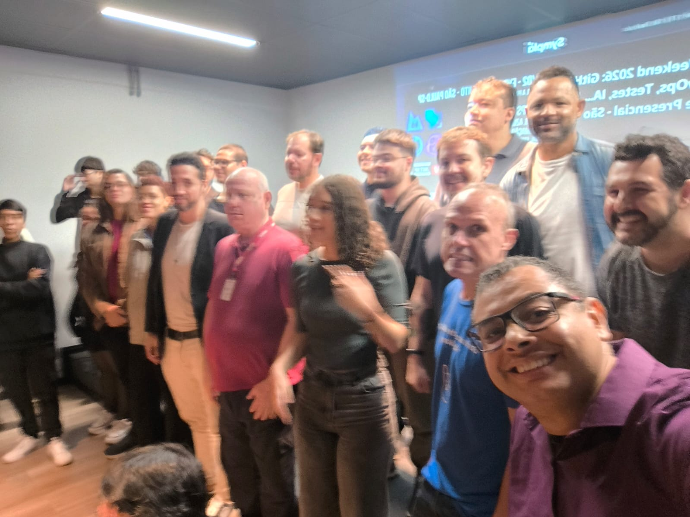

# DevOps Weekend 2026: GitHub, Azure DevOps, Testing, AI...
Photos and general information about the **DevOps Weekend** event, held in the city of São Paulo-SP.

Date: **02/28/2026 (Saturday)**

Organizers:
- **Renato Groffe (Microsoft MVP, Docker Captain, Grafana Champion, APIsec U Ambassador, MTAC)**
- **Milton Camara Gomes (Microsoft MVP, MTAC)**
- **Vinicius Moura (Microsoft MVP)**
- **Atila Olivi (SENAI)**
- **Carlos Machel (AzureBrasil.cloud)**

Number of participants: **42 people**

---

Presentations/talks that took place during the event:

_# GitHub Agentic Workflows_

Speaker: **Vinicius Moura (Microsoft MVP)**

Technologies and topics covered: **GitHub, GitHub Actions, GitHub Copilot, Artificial Intelligence, DevOps, LLMs, AI Agents, MCP, .NET, C#, ASP.NET Core, Minimal APIs, Docker, Containers, Microsoft Azure, Azure Container Apps...**

_# Implementation and Automation of Load Testing with k6, Azure DevOps, and GitHub Actions_

Speaker: **Renato Groffe (Microsoft MVP, Docker Captain, Grafana Champion, APIsec U Ambassador MTAC)**

Technologies and topics covered: **Grafana k6, Load Testing, Application Performance, GitHub, GitHub Actions, Azure DevOps, Azure Pipelines, Azure Repos, .NET 10, C#, ASP.NET Core, Minimal APIs,Docker, Kubernetes, Azure Container Apps, OpenTelemetry, Application Insights, Azure Monitor, Windows, Linux, macOS, xk6, MCP, Apache Kafka, PostgreSQL, SQL Server...**

_# True Observability: monitoring an Azure + SQL Server Ecosystem with Grafana_

Speaker: **Milton Camara Gomes (Microsoft MVP, MTAC)**

Technologies and topics covered: **Grafana, Azure SQL, Microsoft Azure, Grafana Loki, Prometheus, Azure Monitor, Application Insights...**

_# Panel: DevOps in the real world -> automation, cloud, tools, best practices, the use of AI..._

Participants:
- **Renato Groffe (Microsoft MVP, Docker Captain, Grafana Champion, APIsec U Ambassador, MTAC)**
- **Milton Camara Gomes (Microsoft MVP, MTAC)**
- **Vinicius Moura (Microsoft MVP)**
- **Carlos Machel (AzureBrasil.cloud)**
- **Rodrigo Jordão (Senior DevOps Engineer)**

Technologies and topics covered: **DevOps, DevSecOps, Microsoft Azure, GitHub, Azure DevOps, Docker, Kubernetes, Linux, Grafana, Grafana Loki, Grafana Tempo, Grafana Learn, Prometheus, Azure Certifications (AZ-400, AZ-204, AZ-104, AZ-305, AI-102, AZ-900, AI-900, DP-900, SC-900, AZ-500...), GitHub Certifications, Linux Foundation Certifications and Training...**

---

Access this [**link**](/img/) to view all presentation photos.

This event was a partnership between the [**.NET SP**](https://www.meetup.com/dotnet-Sao-Paulo/), [**Azure na Prática**](https://www.youtube.com/azurenapratica), and [**Escola Senai Suíço-Brasileira Paulo Ernesto Tolle**](https://suicobrasileira.sp.senai.br/) communities.

Registration form used: [**Sympla**](https://www.sympla.com.br/evento/devops-weekend-2026-github-azure-devops-testes-ia-gratuito-e-presencial-sao-paulo-sp/3312598)

Location: **Escola SENAI Suíço-Brasileira Paulo Ernesto Tolle - Rua Bento Branco de Andrade Filho, 379 - Santo Amaro - São Paulo/SP - ZIP Code 04757-000**

---

