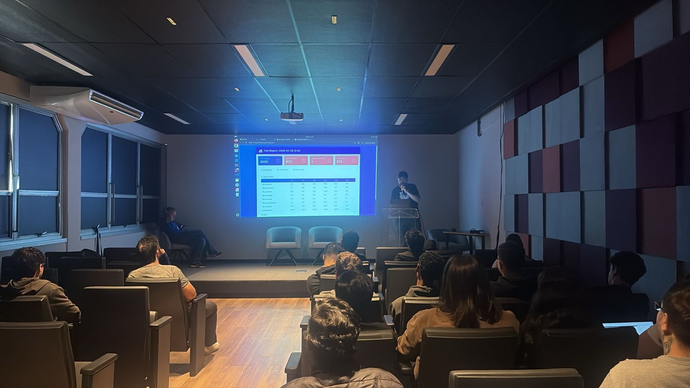
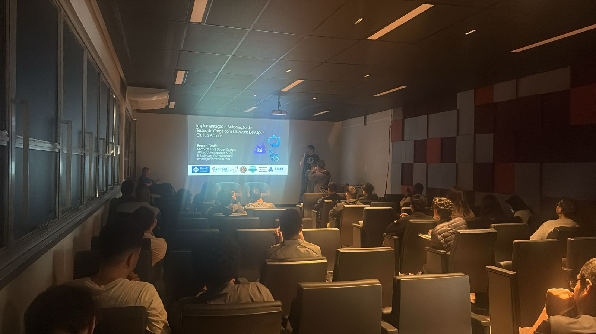
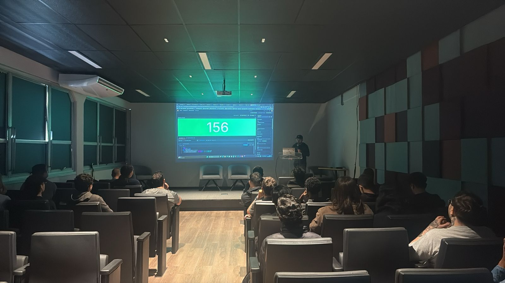
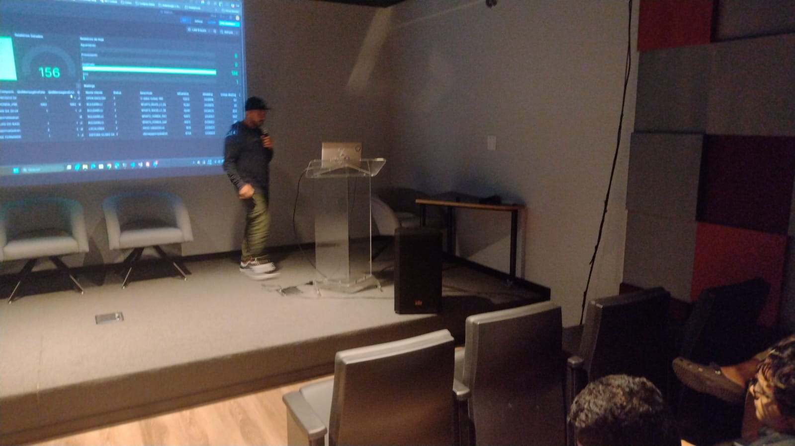
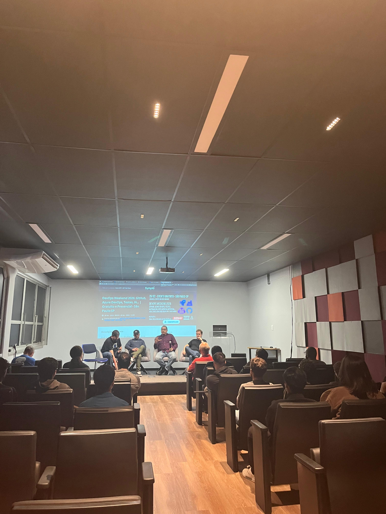
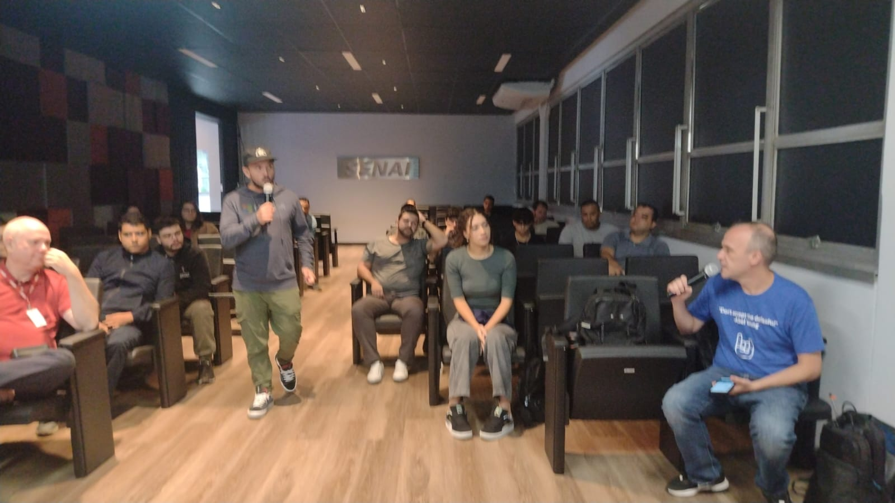
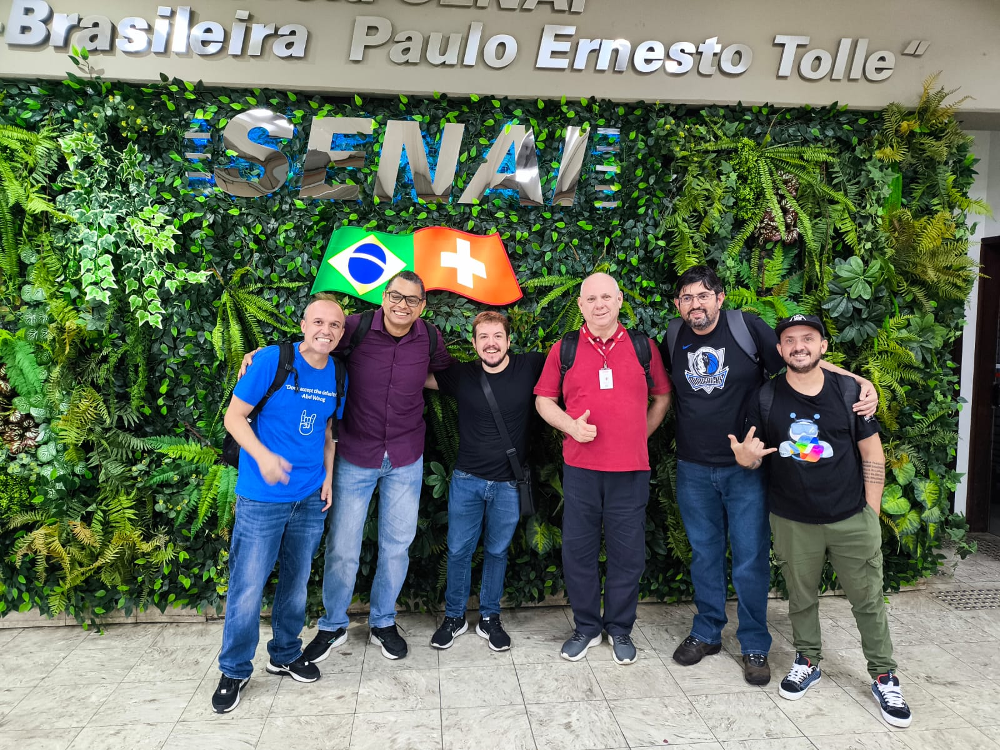
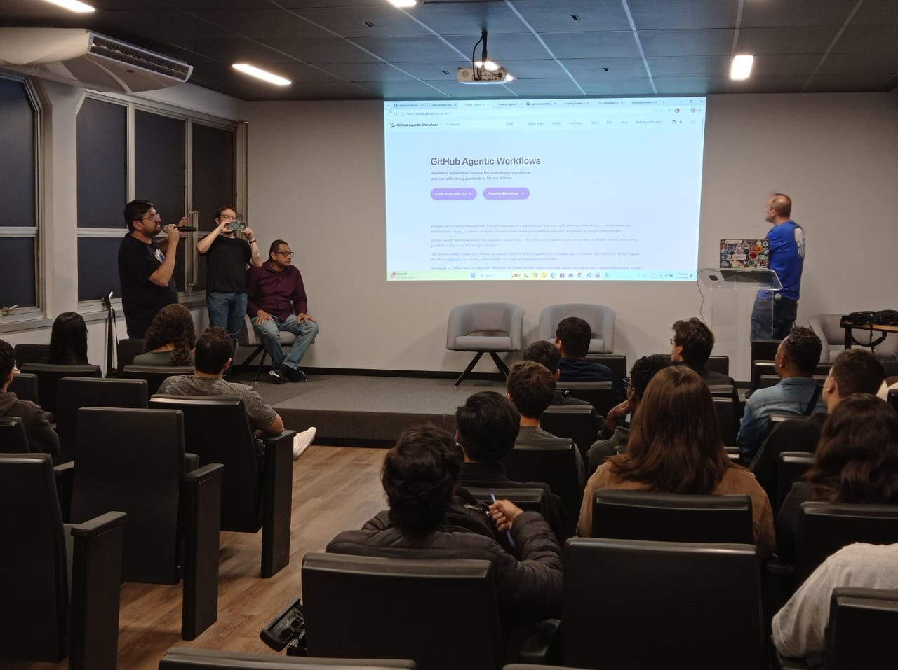

# DevOps Weekend 2026: GitHub, Azure DevOps, Testes, IA...
Fotos e informações gerais sobre o evento **DevOps Weekend**, realizado na cidade de São Paulo-SP.

Data: **28/02/2026 (sábado)**

Organizadores:
- **Renato Groffe (Microsoft MVP, Docker Captain, Grafana Champion, APIsec U Ambassador, MTAC)**
- **Milton Camara Gomes (Microsoft MVP, MTAC)**
- **Vinicius Moura (Microsoft MVP)**
- **Atila Olivi (SENAI)**
- **Carlos Machel (AzureBrasil.cloud)**

Número de participantes: **42 pessoas**

---

xxxxxxxxxxxxxxxxxxxxxxxx
Apresentações previstas:
* Implementação e Automação de Testes de Carga com k6, Azure DevOps e GitHub Actions - Renato Groffe (Microsoft MVP, Docker Captain, Grafana Champion, APISec U Ambassador, MTAC)
* Observabilidade de Verdade: monitorando um Ecossistema Azure + SQL Server com Grafana - Milton Camara Gomes (Microsoft MVP, MTAC)
* Painel: DevOps no mundo real -> automações, nuvem, ferramentas, boas práticas, o uso de IA - Renato Groffe, Milton Camara Gomes, Vinicius Moura, Rodrigo Jordão, Carlos Machel
xxxxxxxxxxxxxxxxxxxxxxxx

Apresentações/talks que aconteceram durante o evento:

_# GitHub Agentic Workflows_

Palestrante: **Vinicius Moura (Microsoft MVP)**

Tecnologias e tópicos abordados: **GitHub, GitHub Copilot, Inteligência Artificial, LLMs, AI Agents, MCP, .NET, C#, ASP.NET Core, Docker, Containers, Microsoft Azure, Azure Container Apps...**

_# Implementação e Automação de Testes de Carga com k6, Azure DevOps e GitHub Actions_

Palestrante: **Renato Groffe (Microsoft MVP, Docker Captain, Grafana Champion, APIsec U Ambassador MTAC)**

Tecnologias e tópicos abordados: **Inteligência Artificial, LLMs, MCP, AI Agents, Containers, Visual Studio Code, GitHub Copilot, .NET, Docker, NuGet, npm, Grafana k6, Docker MCP Catalog, Azure API Management, Microsoft Agent Framework, APIsec MCP Audit, GitHub Actions, Azure DevOps, PostgreSQL...**

_# Observabilidade de Verdade: monitorando um Ecossistema Azure + SQL Server com Grafana_

Palestrante: **Milton Camara Gomes (Microsoft MVP, MTAC)**

Tecnologias e tópicos abordados: **Inteligência Artificial, LLMs, MCP, AI Agents, .NET, C#, Microsoft Azure, Microsoft Copilot 365...**

_# Painel: DevOps no mundo real -> automações, nuvem, ferramentas, boas práticas, o uso de IA..._

Participantes:
- **Renato Groffe (Microsoft MVP, Docker Captain, Grafana Champion, APIsec U Ambassador, MTAC)**
- **Milton Camara Gomes (Microsoft MVP, MTAC)**
- **Vinicius Moura (Microsoft MVP)**
- **Carlos Machel (AzureBrasil.cloud)**
- **Rodrigo Jordão (Senior DevOps Engineer)**

Tecnologias e tópicos abordados: **Inteligência Artificial, LLMs, MCP, AI Agents, GitHub Copilot, Engenharia de Software, Arquitetura de Software, Microsoft Foundry, Boas Práticas de Desenvolvimento...**

---

Acesse este [**link**](/img/) para visualizar todas as fotos das apresentações.

Este evento foi uma parceria entre as comunidades [**.NET SP**](https://www.meetup.com/dotnet-Sao-Paulo/), [**Azure na Prática**](https://www.youtube.com/azurenapratica) e a [**Escola Senai Suíço-Brasileira Paulo Ernesto Tolle**](https://suicobrasileira.sp.senai.br/).

Formulário utilizado para inscrições: [**Sympla**](https://www.sympla.com.br/evento/devops-weekend-2026-github-azure-devops-testes-ia-gratuito-e-presencial-sao-paulo-sp/3312598)

Local: **Escola SENAI Suíço-Brasileira Paulo Ernesto Tolle - Rua Bento Branco de Andrade Filho, 379 - Santo Amaro - São Paulo/SP - CEP 04757-000**

---

