# DevOps Weekend 2026: GitHub, Azure DevOps, Testes, IA...
Fotos e informações gerais sobre o evento **DevOps Weekend**, realizado na cidade de São Paulo-SP.

Data: **28/02/2026 (sábado)**

Organizadores:
- **Renato Groffe (Microsoft MVP, Docker Captain, Grafana Champion, APIsec U Ambassador, MTAC)**
- **Milton Camara Gomes (Microsoft MVP, MTAC)**
- **Vinicius Moura (Microsoft MVP)**
- **Atila Olivi (SENAI)**
- **Carlos Machel (AzureBrasil.cloud)**

Número de participantes: **42 pessoas**

---

Apresentações/talks que aconteceram durante o evento:

_# GitHub Agentic Workflows_

Palestrante: **Vinicius Moura (Microsoft MVP)**

Tecnologias e tópicos abordados: **GitHub, GitHub Actions, GitHub Copilot, Inteligência Artificial, DevOps, LLMs, AI Agents, MCP, .NET, C#, ASP.NET Core, Minimal APIs, Docker, Containers, Microsoft Azure, Azure Container Apps...**

_# Implementação e Automação de Testes de Carga com k6, Azure DevOps e GitHub Actions_

Palestrante: **Renato Groffe (Microsoft MVP, Docker Captain, Grafana Champion, APIsec U Ambassador MTAC)**

Tecnologias e tópicos abordados: **Grafana k6, Testes de Carga, Performance em Aplicações, GitHub, GitHub Actions, Azure DevOps, Azure Pipelines, Azure Repos, .NET 10, C#, ASP.NET Core, Minimal APIs,Docker, Kubernetes, Azure Container Apps, OpenTelemetry, Application Insights, Azure Monitor, Windows, Linux, macOS, xk6, MCP, Apache Kafka, PostgreSQL, SQL Server...**

_# Observabilidade de Verdade: monitorando um Ecossistema Azure + SQL Server com Grafana_

Palestrante: **Milton Camara Gomes (Microsoft MVP, MTAC)**

Tecnologias e tópicos abordados: **Grafana, Azure SQL, Microsoft Azure, Grafana Loki, Prometheus, Azure Monitor, Application Insights...**

_# Painel: DevOps no mundo real -> automações, nuvem, ferramentas, boas práticas, o uso de IA..._

Participantes:
- **Renato Groffe (Microsoft MVP, Docker Captain, Grafana Champion, APIsec U Ambassador, MTAC)**
- **Milton Camara Gomes (Microsoft MVP, MTAC)**
- **Vinicius Moura (Microsoft MVP)**
- **Carlos Machel (AzureBrasil.cloud)**
- **Rodrigo Jordão (Senior DevOps Engineer)**

Tecnologias e tópicos abordados: **DevOps, DevSecOps, Microsoft Azure, GitHub, Azure DevOps, Docker, Kubernetes, Linux, Grafana, Grafana Loki, Grafana Tempo, Grafana Learn, Prometheus, Certificações Azure (AZ-400, AZ-204, AZ-104, AZ-305, AI-102, AZ-900, AI-900, DP-900, SC-900, AZ-500...), Certifições GitHub, Certificações e Treinamentos Linux Foundation...**

---

Acesse este [**link**](/img/) para visualizar todas as fotos das apresentações.

Este evento foi uma parceria entre as comunidades [**.NET SP**](https://www.meetup.com/dotnet-Sao-Paulo/), [**Azure na Prática**](https://www.youtube.com/azurenapratica) e a [**Escola Senai Suíço-Brasileira Paulo Ernesto Tolle**](https://suicobrasileira.sp.senai.br/).

Formulário utilizado para inscrições: [**Sympla**](https://www.sympla.com.br/evento/devops-weekend-2026-github-azure-devops-testes-ia-gratuito-e-presencial-sao-paulo-sp/3312598)

Local: **Escola SENAI Suíço-Brasileira Paulo Ernesto Tolle - Rua Bento Branco de Andrade Filho, 379 - Santo Amaro - São Paulo/SP - CEP 04757-000**

---

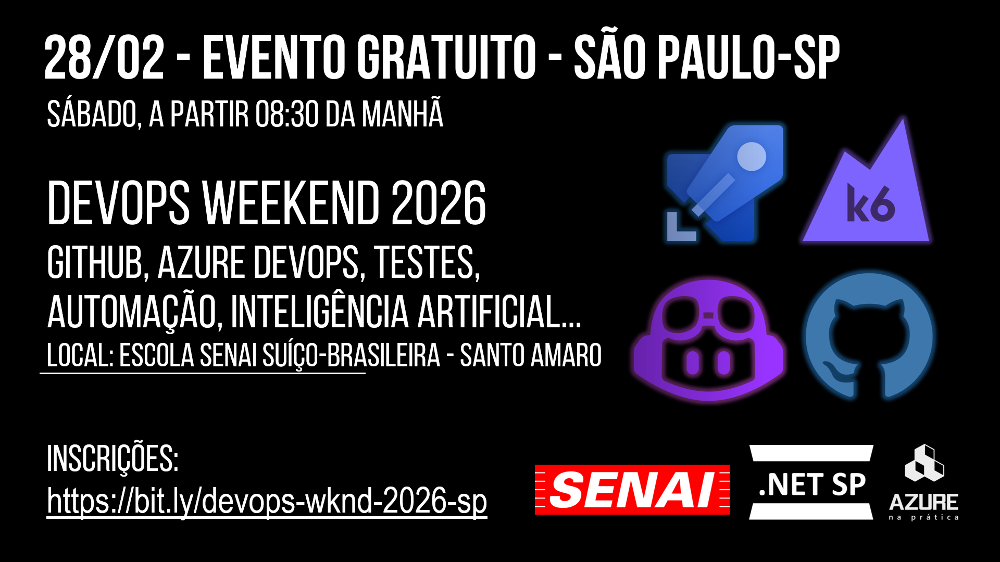

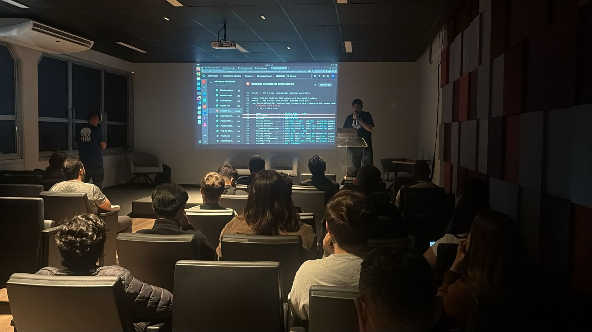

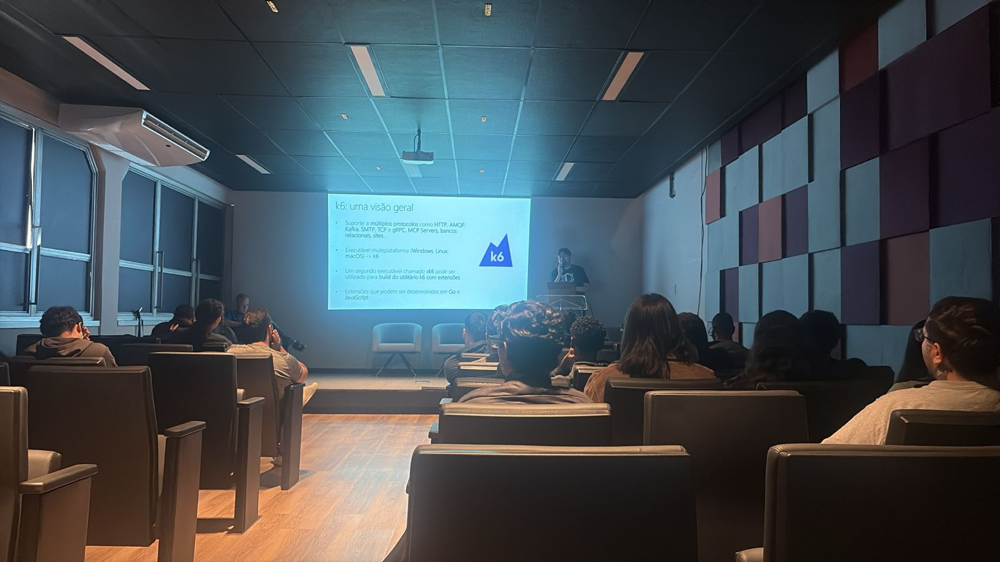

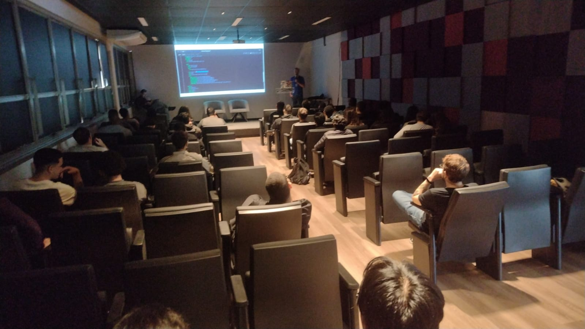

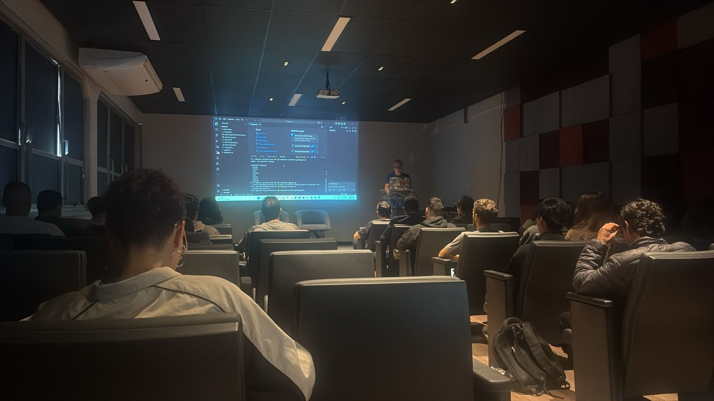

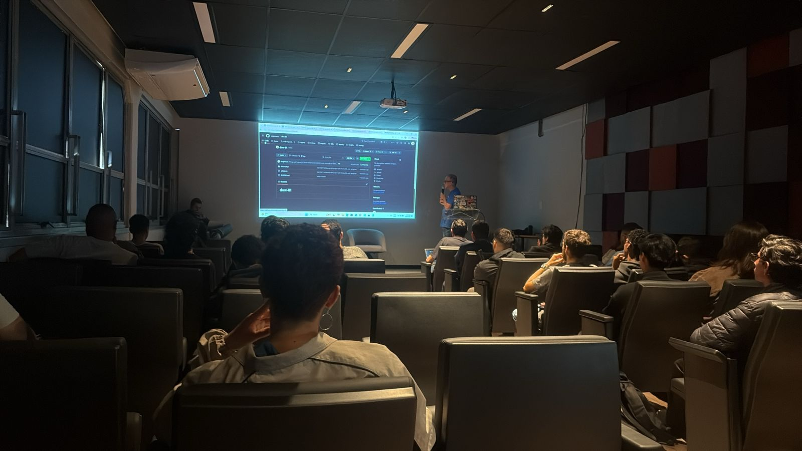

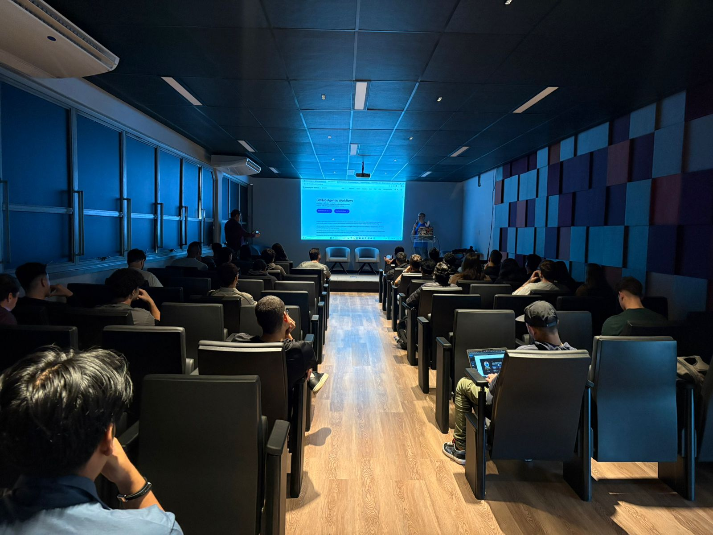

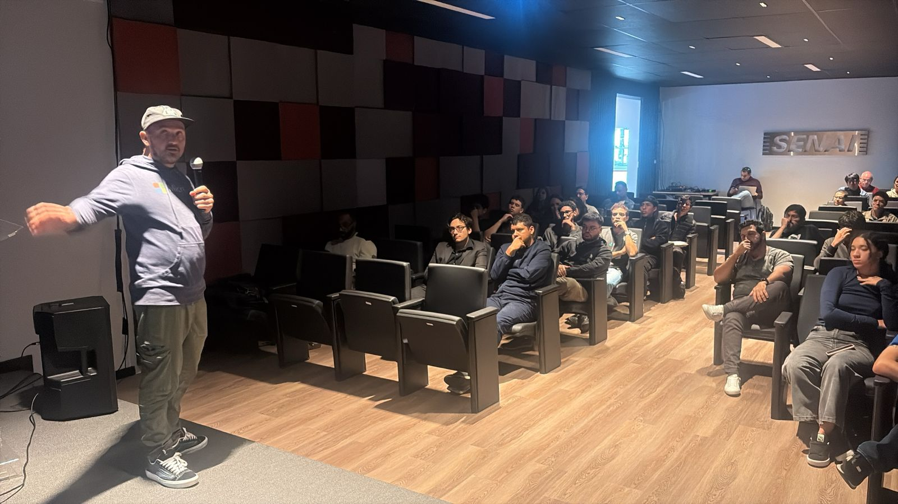

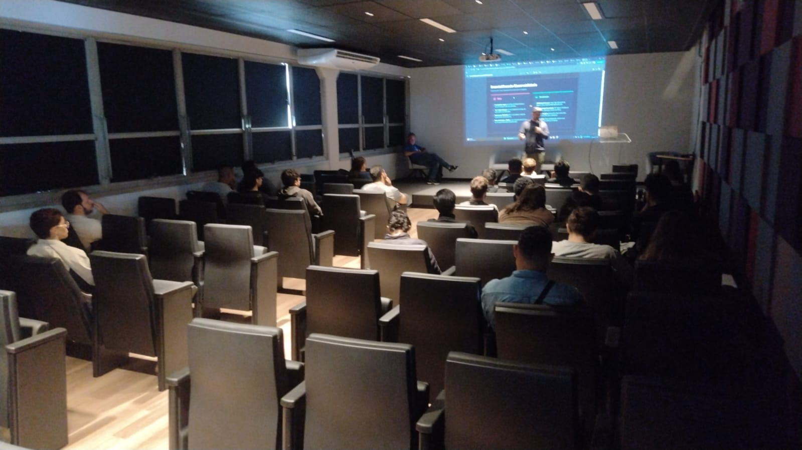

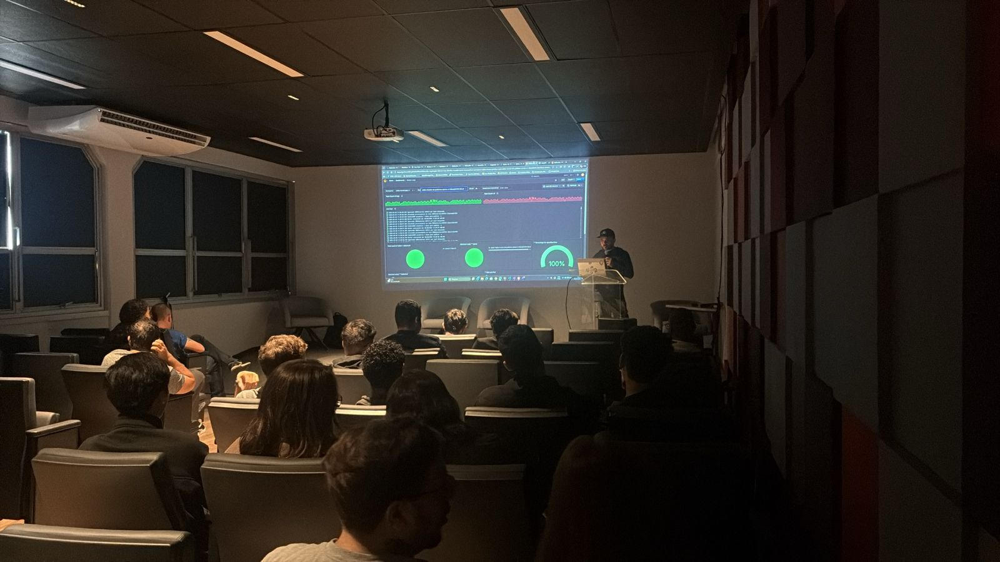

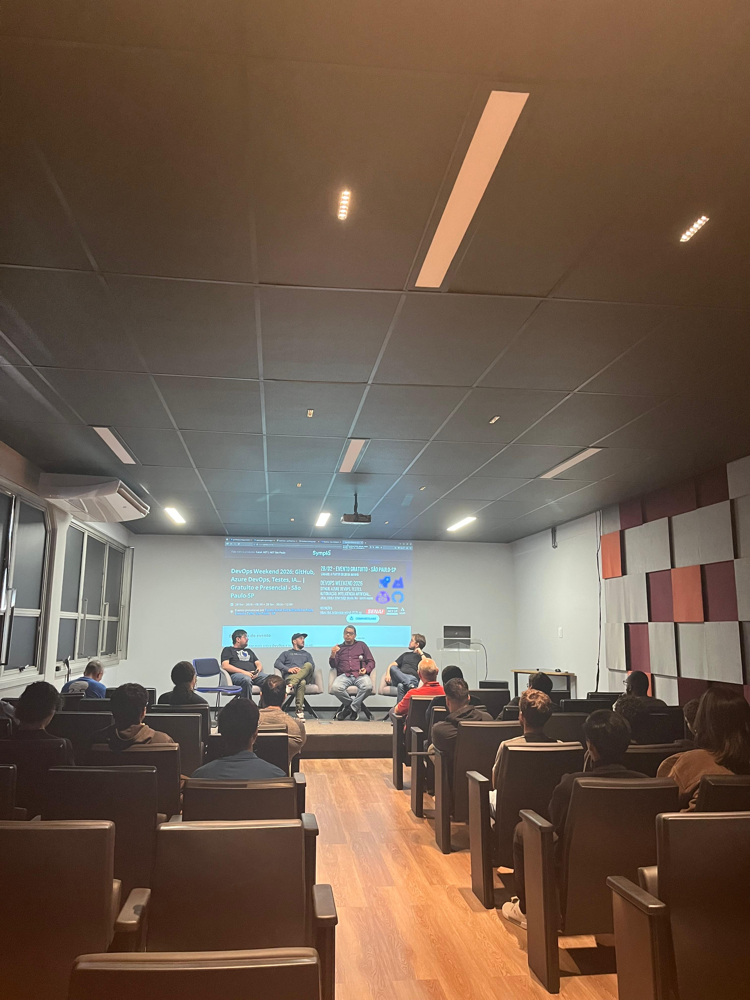

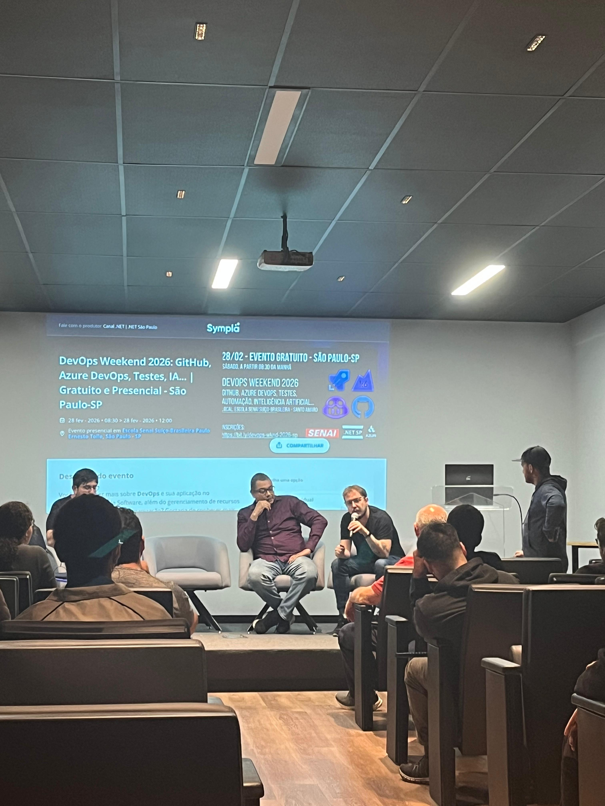

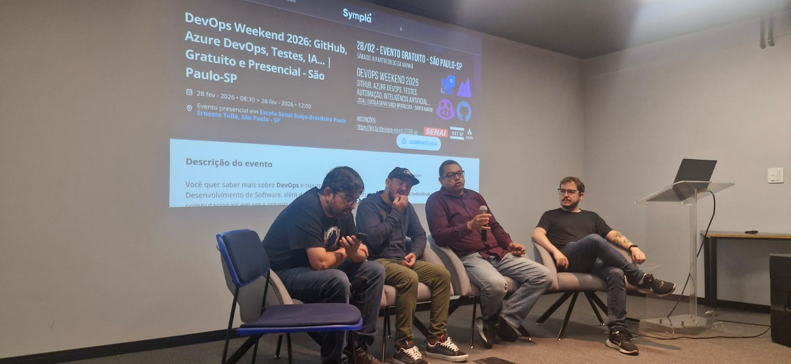

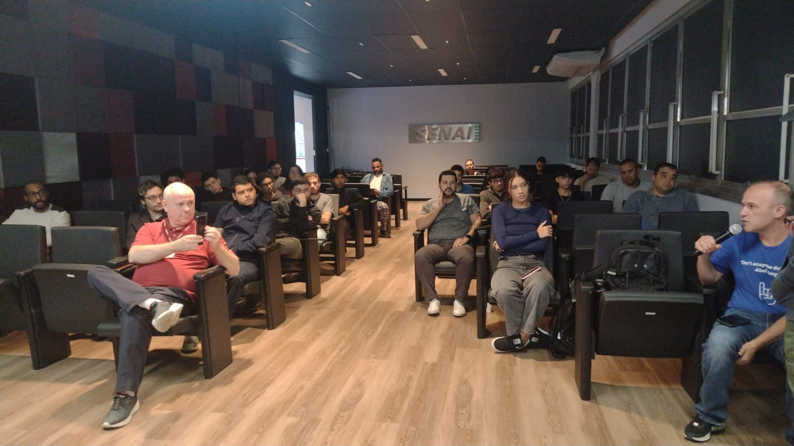

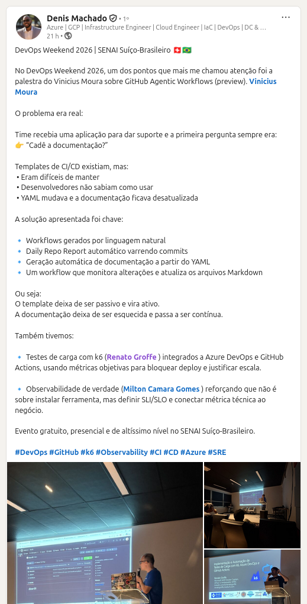

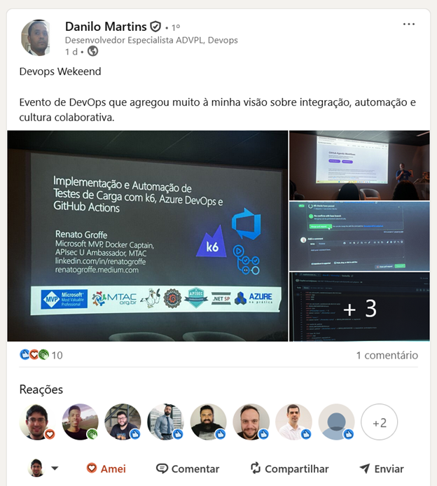